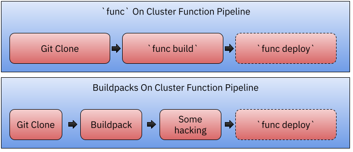

# Func OnCluster build experiments
Some tekton + build packs + func experiments for OnCluster Builds

The objective of this experiment is to enable users to build func projects in a remote cluster which has Tekton Installed. 

# OnCluster Build for a `func` project
On the `example` directory you can find two pipelines that builds and deploy a `func` project which the source code lives in github. 

To accomplish this, we will install a `func` as two Tekton Tasks and we will use them inside a Tekton Pipeline that will ([func-onclusterbuild-build-deploy-pipeline.yaml](example/func-onclusterbuild-build-deploy-pipeline.yaml)
): 
- Clone Repository from Github
- Use `func build` to build the container using Buildpacks
- Use `func deploy` to deploy the `func` project to the Cluster. 


Another approach ([func-onclusterbuild-buildpacks-pipeline.yaml](example/func-onclusterbuild-buildpacks-pipeline.yaml)) would be to use the Buildpacks Tekton Task and have a pipeline that do: 
- Clone Repository from Github
- Use buildpack task to build the function project
- Do some manipulation of the `func.yaml` file for deployment
- Use `func deploy` to deploy the function in the cluster



The pipelines are trying to build a `func` project hosted in this repository: [https://github.com/salaboy/dad-vibes-functions](https://github.com/salaboy/dad-vibes-functions)

## Notes / Issues

- I needed to hack func in order to produce the `func` container image because I was hitting a "Not initialized" function issue caused by a missing Created field in the `func.yaml` file. @kingland mentioned in slack that this is fixed here: [https://github.com/knative-sandbox/kn-plugin-func/pull/664](https://github.com/knative-sandbox/kn-plugin-func/pull/664)
- It will be great if `func build` and `func deploy` can be parameterized to not need the `func.yaml` file, so for example the pipeline can just use the SHA of the image to do the deploy
  - Also this avoids the commands writing back info in the `func.yaml` file
- It will be interesting to define remote build and remote deploy.. so you can choose what to do where. 
- Is there any reason why `func build` doesn't do the push of the produced image? This logic of "push" is now defined inside `func deploy` which doesn't make much sense if we are trying to split responsabilities for the pipeline tasks. [https://github.com/knative-sandbox/kn-plugin-func/issues/676](https://github.com/knative-sandbox/kn-plugin-func/issues/676)

- The buildpacks pipeline is still WIP, not sure if it is worth it (we decided that is not the favourite option in the WG meeting) 

## Pre Requistes
- Kubernetes Cluster
- Tekton installed in the cluster
- Knative Serving installed in the cluster


## Installing `func` Tekton resources

This repository define two Custom Tekton Tasks [`func build`](catalog/task/func-build/0.1) and [`func deploy`](catalog/task/func-deploy/0.1) to install them you can run:  

```
kubectl apply --recursive -f catalog/task/

```

These two tasks are using a custom version of a Docker image that I am hosting in Docker Hub under my user `salaboy` which fixes some bugs in `func`

```salaboy/func-2e37ecdd2ee11985d861179f5d0a0fbb@sha256:33468313582069d2e6ea850cd526858918db215c1bf98558ece2f8967201937f
```
I've built this Docker image by running:
```
`ko publish ./cmd/func`
```

I used the following `.ko.yaml`:

```
defaultBaseImage: gcr.io/distroless/static:nonroot
baseImageOverrides:
  knative.dev/kn-plugin-func/cmd/func: docker.io/library/alpine:latest
```

`func` will need to have your docker registry credentials to be able to push the produces container image to a public registry. 


```
kubectl create secret docker-registry regcred --docker-server=https://index.docker.io/v1/ --docker-username=DOCKER_USERNAME --docker-password=DOCKER_PASSWORD --docker-email DOCKER_EMAIL
```

You can now install the example pipeline with and a required PVC for sources and cache:

```
kubectl apply -f examples/pvc.yaml
kubectl apply -f examples/func-onclusterbuild-build-deploy-pipeline.yaml

```

You can now create new instances of this pipeline by running: 

```
kubectl apply -f examples/pr.yaml
```

**Note**: I am using a `PipelineRun` because I need to set up a ServiceAccount for Build and another one for Deploy, and I haven't found the way to do it using `tkn`

```
tkn pipeline start func-pipeline -s dockerconfig -w name=sources,claimName=source-pvc,subPath=source -w name=cache,claimName=source-pvc,subPath=cache -w name=dockerconfig,secret=regcred

```


## References


- [Proposal](https://docs.google.com/document/d/1iQFVtfsrYb4pp616h3B_IXQB1Cck1oxt7ypZyU8ChzE/edit)

- [Tekton `tkn`](https://github.com/tektoncd/cli)

- [Tekton Catalog](https://github.com/tektoncd/catalog/)

- [Tekton Buildpacks Task](https://github.com/tektoncd/catalog/tree/main/task/buildpacks/0.3)

- [Tekton Buildpacks Task Example](https://buildpacks.io/docs/tools/tekton/)

-[Tekton `kn` Task](https://github.com/tektoncd/catalog/blob/main/task/kn/0.1/kn.yaml)

- https://github.com/evankanderson/springone-2021-knative-tekton/blob/main/knative-install/buildpack-pipeline.yaml

- https://github.com/cdfoundation/sig-events/tree/main/poc/tekton 

 
